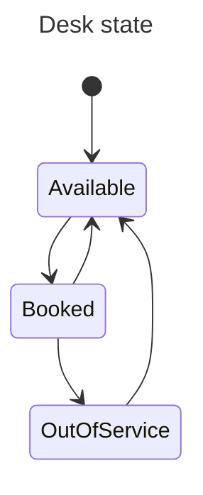
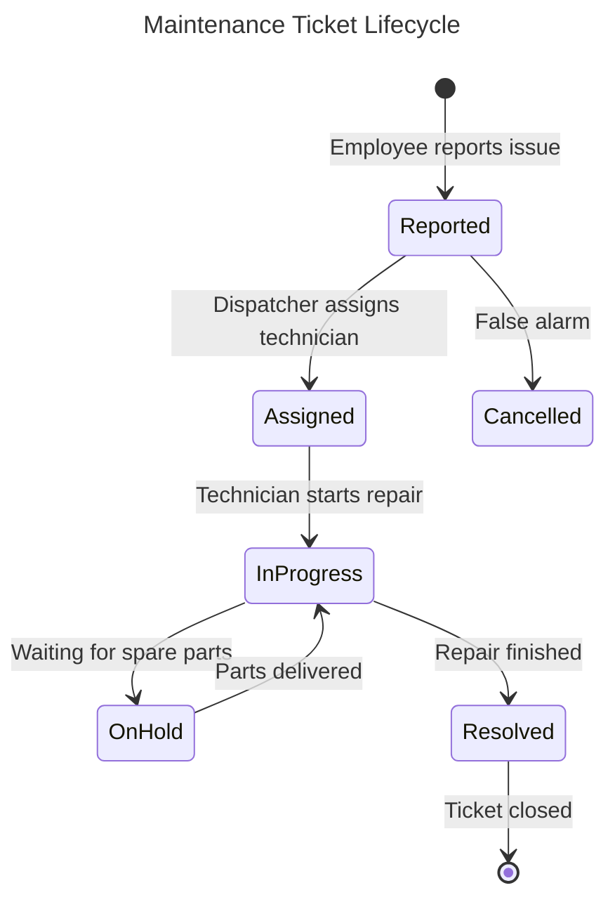

# Booking

```mermaid
---
title: Desk state
---
stateDiagram
    [*] --> Available
    Available --> Booked
    Booked --> Available
    Booked --> OutOfService
    OutOfService --> Available
```

# Analytics

# Maintenance

```mermaid
---
title: Maintenance Ticket Lifecycle
---
stateDiagram-v2
    [*] --> Reported : Employee reports issue
    Reported --> Assigned : Dispatcher assigns technician
    Reported --> Cancelled : False alarm
    
    Assigned --> InProgress : Technician starts repair
    InProgress --> OnHold : Waiting for spare parts
    OnHold --> InProgress : Parts delivered
    
    InProgress --> Resolved : Repair finished
    Resolved --> [*] : Ticket closed
```

# Inventory
