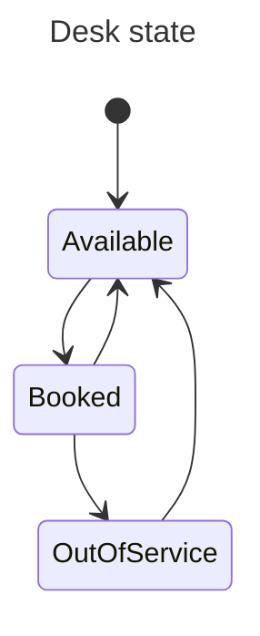
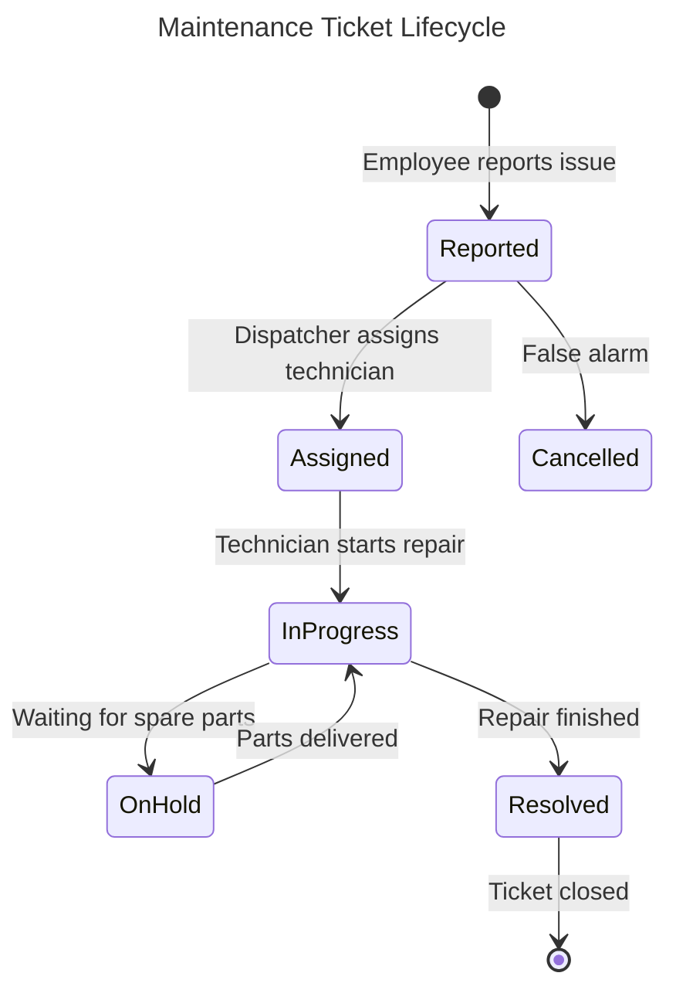
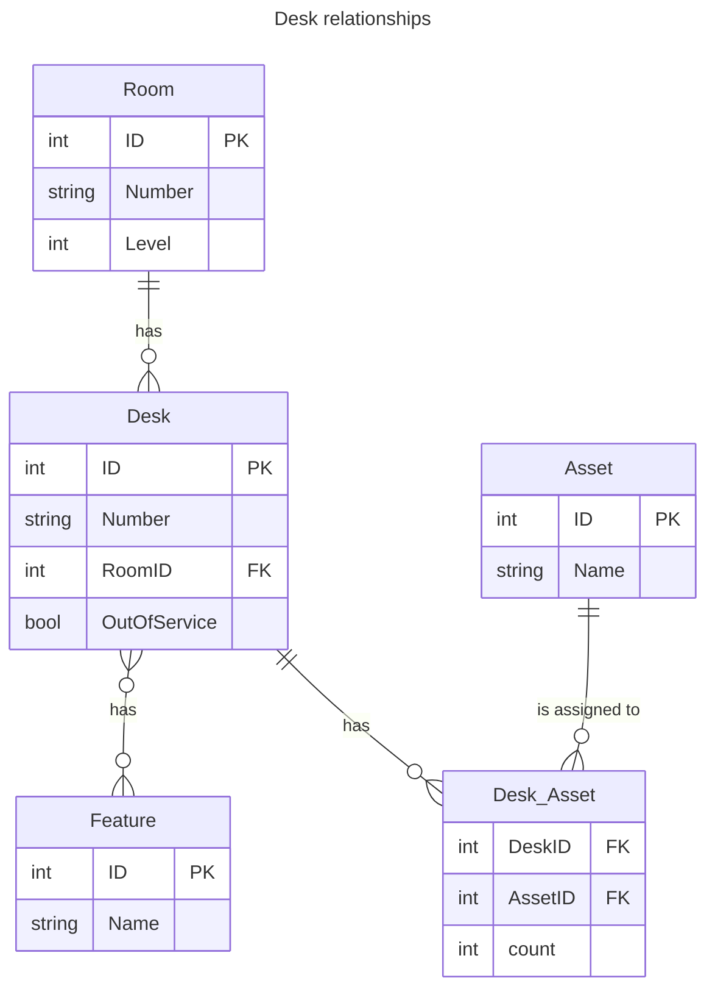
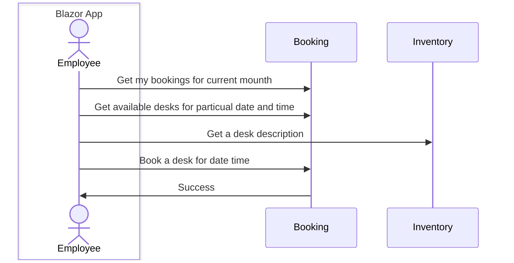
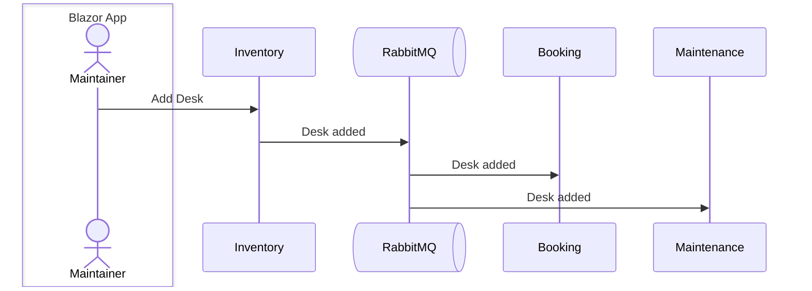
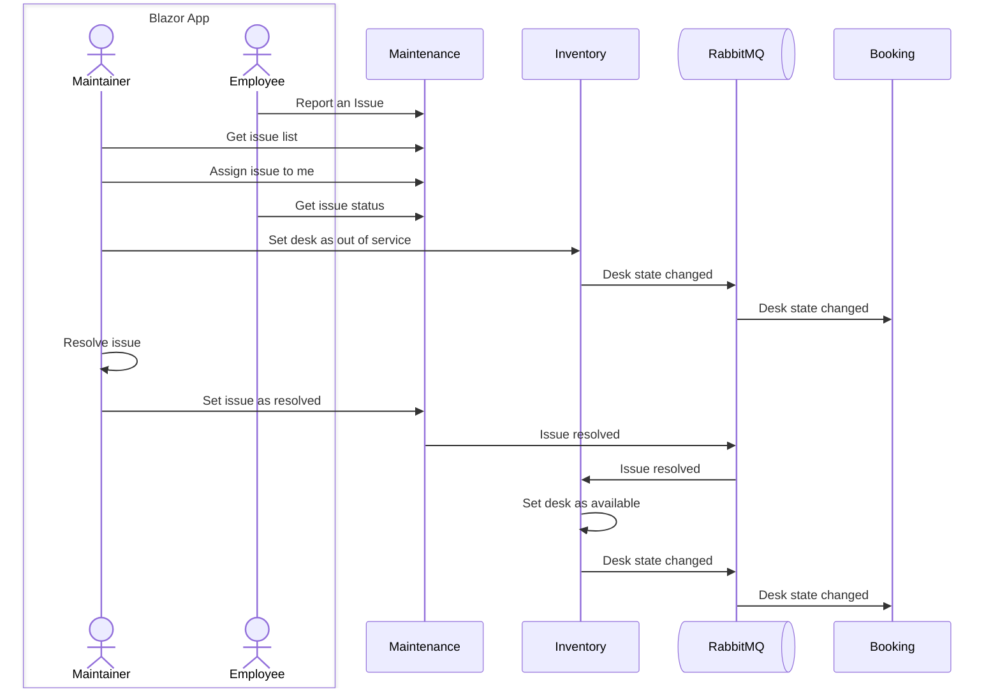

# Static view
## Booking

```mermaid
---
title: Desk state
---
stateDiagram
    [*] --> Available
    Available --> Booked
    Booked --> Available
    Booked --> OutOfService
    OutOfService --> Available
```

## Analytics

## Maintenance

```mermaid
---
title: Maintenance Ticket Lifecycle
---
stateDiagram-v2
    [*] --> Reported : Employee reports issue
    Reported --> Assigned : Dispatcher assigns technician
    Reported --> Cancelled : False alarm
    
    Assigned --> InProgress : Technician starts repair
    InProgress --> OnHold : Waiting for spare parts
    OnHold --> InProgress : Parts delivered
    
    InProgress --> Resolved : Repair finished
    Resolved --> [*] : Ticket closed
```

## Inventory

```mermaid
---
title: Desk relationships
---
erDiagram
    Room {
        int ID PK
        string Number
        int Level
    }
    Desk {
        int ID PK
        string Number
        int RoomID FK
        bool OutOfService
    }
    Feature {
        int ID PK
        string Name
    }
    Asset {
        int ID PK
        string Name
    }
    Desk_Asset {
        int DeskID FK
        int AssetID FK
        int count
    }

    %% Relacja N:N - Desk ma wiele lub 0 Feature i na odwrót 
    Desk }o--o{ Feature: "has"

    %% Relacja 1:N - Jeden Pokój ma wiele Biurek
    Room ||--o{ Desk : "has"

    %% Relacja 1:N - Jedno Biurko ma wiele wpisów o sprzęcie
    Desk ||--o{ Desk_Asset : "has"
    
    %% Relacja 1:N - Jeden Sprzęt ze słownika może być na wielu biurkach
    Asset ||--o{ Desk_Asset : "is assigned to"
```
## C4 Diagram

```mermaid
C4Container
    title Diagram Kontenerów (C4) dla systemu Hot-Desk

    Person(employee, "Employee", "Pracownik rezerwujący biurko lub zgłaszający awarię.")
    Person(maintainer, "Maintainer", "Technik obsługujący zgłoszenia awarii biurek i sprzętu.")
    Person(admin, "Platform Admin", "Administrator zarządzający uprawnieniami i systemem.")

    System_Ext(ad, "Active Directory / IdP", "System uwierzytelniania i autoryzacji (np. Keycloak / Duende).")

    System_Boundary(hotdesk, "System Hot-Desk") {
        Container(spa, "Blazor App", "Blazor", "Główny interfejs użytkownika (Aplikacja kliencka).")
        
        Container(api_booking, "Booking Service", ".NET / C#", "Zarządza logiką rezerwacji biurek na dany czas.")
        Container(api_inventory, "Inventory Service", ".NET / C#", "Zarządza strukturą biura (pokoje, biurka, sprzęt, status).")
        Container(api_maintenance, "Maintenance Service", ".NET / C#", "Obsługuje cykl życia zgłoszeń technicznych (awarie).")
        Container(api_analytics, "Analytics Service", ".NET / C#", "Gromadzi dane i dostarcza statystyki użycia biura.")
        
        ContainerDb(msg_broker, "Message Broker", "RabbitMQ", "Zapewnia asynchroniczną komunikację opartą na zdarzeniach (Event-driven).")
        
        ContainerDb(db_inventory, "Inventory DB", "Relacyjna Baza Danych", "Przechowuje ERD: Pokoje, Biurka, Wyposażenie.")
        ContainerDb(db_booking, "Booking DB", "Relacyjna Baza Danych", "Przechowuje dane rezerwacji pracowników.")
        ContainerDb(db_maintenance, "Maintenance DB", "Relacyjna Baza Danych", "Przechowuje tickety serwisowe i ich statusy.")
    }

    Rel(employee, spa, "Przegląda i rezerwuje biurka, zgłasza awarie", "HTTPS")
    Rel(maintainer, spa, "Przegląda i rozwiązuje tickety serwisowe", "HTTPS")
    Rel(admin, ad, "Zarządza użytkownikami i grupami", "HTTPS")

    Rel(spa, ad, "Uwierzytelnia użytkownika (SSO/OIDC)", "HTTPS")
    
    Rel(spa, api_booking, "Pobiera dostępne biurka, rezerwuje", "REST/HTTPS")
    Rel(spa, api_inventory, "Pobiera opisy i atrybuty biurek", "REST/HTTPS")
    Rel(spa, api_maintenance, "Pobiera listę zgłoszeń, zgłasza awarię", "REST/HTTPS")
    Rel(spa, api_analytics, "Pobiera logi / analitykę", "REST/HTTPS")

    Rel(api_inventory, db_inventory, "Odczytuje/Zapisuje", "TCP")
    Rel(api_booking, db_booking, "Odczytuje/Zapisuje", "TCP")
    Rel(api_maintenance, db_maintenance, "Odczytuje/Zapisuje", "TCP")

    Rel(api_inventory, msg_broker, "Publikuje (np. Biurko dodane, Stan zmieniony)", "AMQP")
    Rel(api_maintenance, msg_broker, "Publikuje (np. Awaria zgłoszona, Awaria rozwiązana)", "AMQP")
    
    Rel(msg_broker, api_booking, "Subskrybuje (reakcja na wyłączenie biurka)", "AMQP")
    Rel(msg_broker, api_maintenance, "Subskrybuje (reakcja na dodanie biurka)", "AMQP")
    Rel(msg_broker, api_inventory, "Subskrybuje (reakcja na naprawę awarii)", "AMQP")
```

# Dynamic view
## Booking a desk

```mermaid
sequenceDiagram
    box Blazor App
    actor emp as Employee
    end
    emp ->> Booking: Get my bookings for current mounth
    emp ->> Booking: Get available desks for particual date and time
    emp ->> Inventory: Get a desk description
    emp ->> Booking: Book a desk for date time
    Booking ->> emp: Success
```

## Adding Desk

```mermaid
sequenceDiagram
    box Blazor App
    actor mnt as Maintainer
    end
    mnt ->> Inventory: Add Desk
    Inventory ->> rabbit: Desk added
    participant rabbit@{ "type" : "queue" } as RabbitMQ
    rabbit ->> Booking: Desk added
    rabbit ->> Maintenance: Desk added
```

## Reporting an issue

```mermaid
sequenceDiagram
    box Blazor App
    actor mnt as Maintainer
    actor emp as Employee
    end
    participant main as Maintenance
    emp ->> main: Report an Issue
    mnt ->> main: Get issue list
    mnt ->> main: Assign issue to me
    emp ->> main: Get issue status
    mnt ->> Inventory: Set desk as out of service
    Inventory ->> rabbit: Desk state changed
    rabbit ->> Booking: Desk state changed
    mnt ->> mnt: Resolve issue
    mnt ->> main: Set issue as resolved
    participant rabbit@{ "type" : "queue" } as RabbitMQ
    main ->> rabbit: Issue resolved
    rabbit ->> Inventory: Issue resolved
    Inventory ->> Inventory: Set desk as available
    Inventory ->> rabbit: Desk state changed
    rabbit ->> Booking: Desk state changed
```
