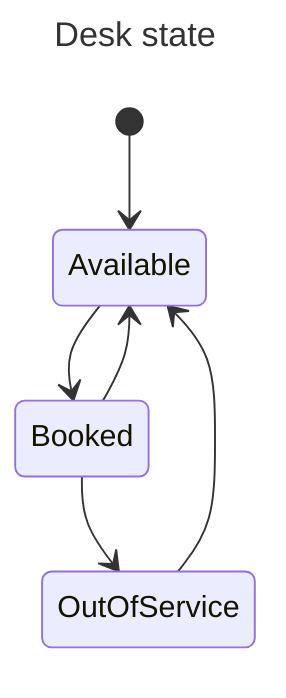
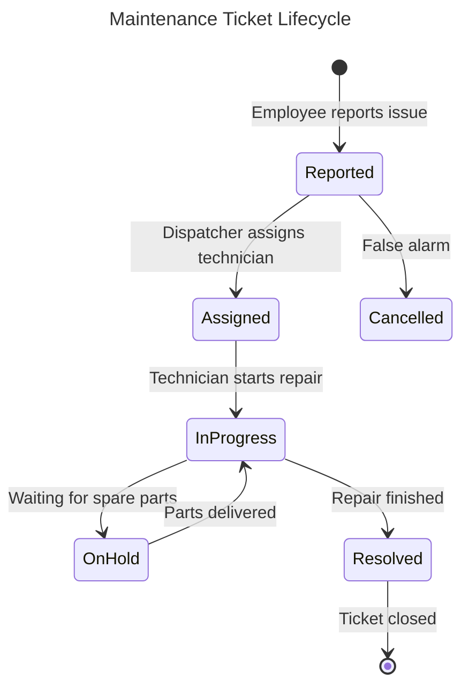
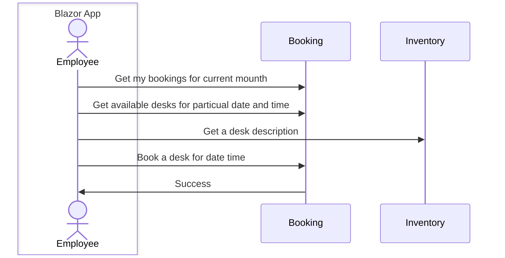
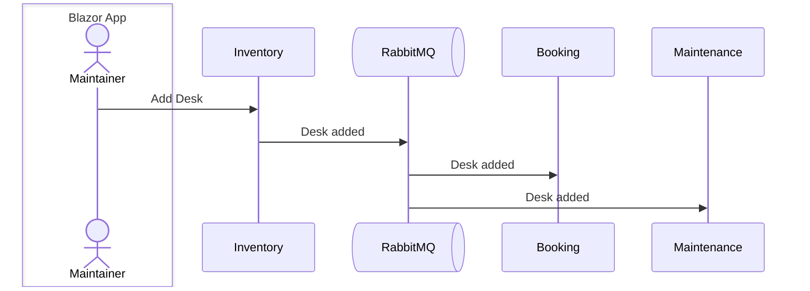
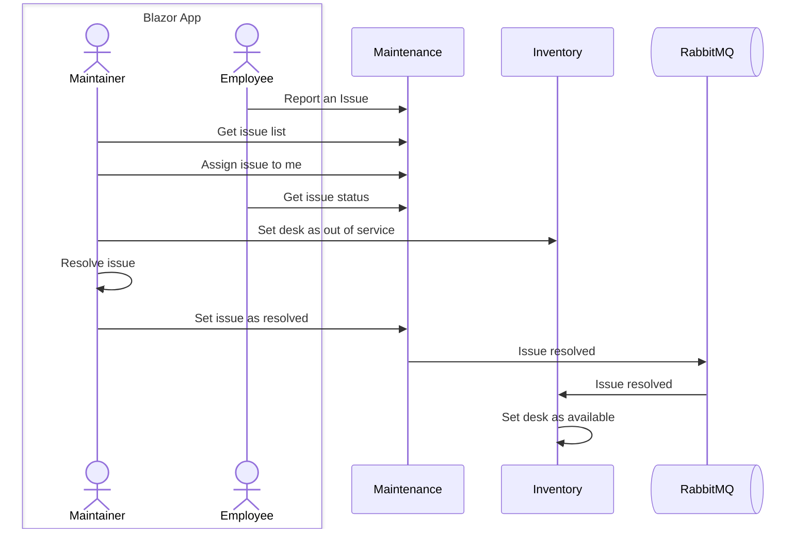

# Static view
## Booking

```mermaid
---
title: Desk state
---
stateDiagram
    [*] --> Available
    Available --> Booked
    Booked --> Available
    Booked --> OutOfService
    OutOfService --> Available
```

## Analytics

## Maintenance

```mermaid
---
title: Maintenance Ticket Lifecycle
---
stateDiagram-v2
    [*] --> Reported : Employee reports issue
    Reported --> Assigned : Dispatcher assigns technician
    Reported --> Cancelled : False alarm
    
    Assigned --> InProgress : Technician starts repair
    InProgress --> OnHold : Waiting for spare parts
    OnHold --> InProgress : Parts delivered
    
    InProgress --> Resolved : Repair finished
    Resolved --> [*] : Ticket closed
```

## Inventory

# Dynamic view
## Booking a desk

```mermaid
sequenceDiagram
    box Blazor App
    actor emp as Employee
    end
    emp ->> Booking: Get my bookings for current mounth
    emp ->> Booking: Get available desks for particual date and time
    emp ->> Inventory: Get a desk description
    emp ->> Booking: Book a desk for date time
    Booking ->> emp: Success
```

## Adding Desk

```mermaid
sequenceDiagram
    box Blazor App
    actor mnt as Maintainer
    end
    mnt ->> Inventory: Add Desk
    Inventory ->> rabbit: Desk added
    participant rabbit@{ "type" : "queue" } as RabbitMQ
    rabbit ->> Booking: Desk added
    rabbit ->> Maintenance: Desk added
```

## Reporting an issue

```mermaid
sequenceDiagram
    box Blazor App
    actor mnt as Maintainer
    actor emp as Employee
    end
    participant main as Maintenance
    emp ->> main: Report an Issue
    mnt ->> main: Get issue list
    mnt ->> main: Assign issue to me
    emp ->> main: Get issue status
    mnt ->> Inventory: Set desk as out of service
    mnt ->> mnt: Resolve issue
    mnt ->> main: Set issue as resolved
    participant rabbit@{ "type" : "queue" } as RabbitMQ
    main ->> rabbit: Issue resolved
    rabbit ->> Inventory: Issue resolved
    Inventory ->> Inventory: Set desk as available
```
